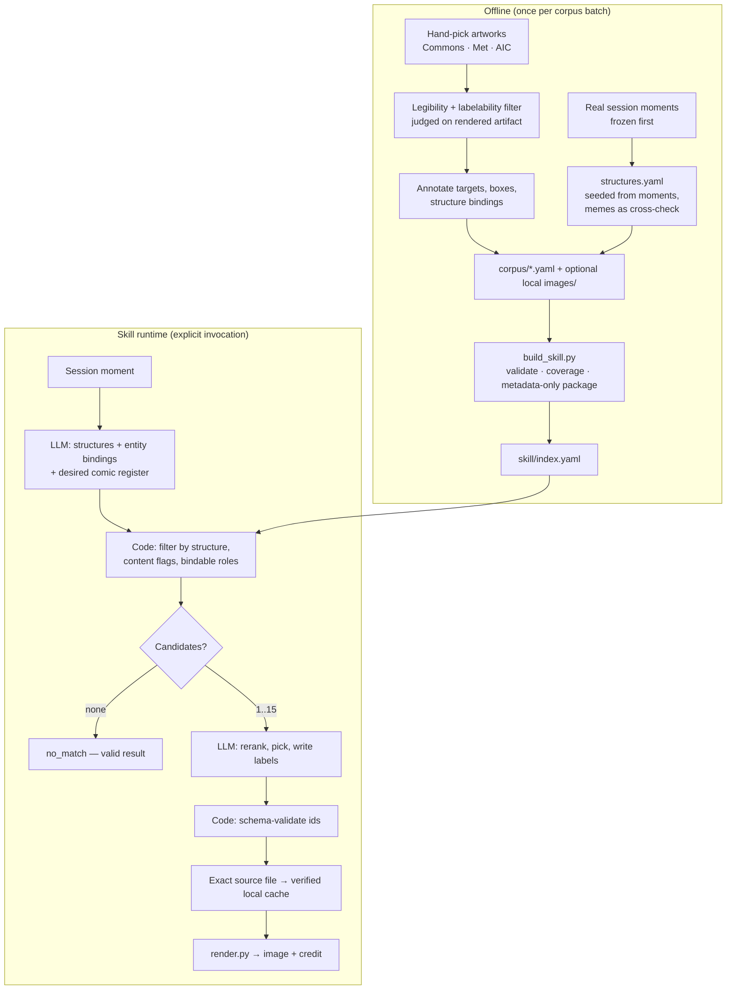

# art-meme — Design

## Goal

**Give an agent the ability to respond to an explicit request in a live session with a fine-art meme: a public-domain artwork whose emotional structure matches the moment, with short labels composited onto its visual targets mapping them to the entities in the moment.**

Unpacked:

- **Input** — an explicit invocation ("meme this") plus the session moment it points at: a win, a blunder, a temptation, a disaster being ignored. Autonomous triggering (agent decides the moment is meme-worthy) is deferred; it is a separate product bet with a much higher quality bar.
- **Output** — an image: the artwork full-frame and unaltered (no cropping in v1; credit strip appended below the canvas, never over it), with labels composited at annotated positions. Abstention (`no_match`) is a valid, successful output — forcing a meme is the worst default.
- **The bet** — great figurative art already encodes the emotional structures memes do, painted better. This is a hypothesis, not a claim: structural correctness is only the setup, and the validation protocol measures whether the output actually lands.
- **Evaluator** — Mike is the sole taste authority. "Lands" means: *would send without explanation*.
- **Done means** — the skill is installed and used in real sessions; the corpus and annotations iterate until picks are routinely would-send. Two invariants survive iteration: abstention stays a valid output, and content-flag violations are always defects.
- **Not the goal** — a meme generator app, a browsable art pack, a trend-tracking meme service, autonomous interjection, or multi-panel sequences (Galaxy Brain escalations are an explicit non-goal for v1, not an open question). The pack is a test fixture; the skill is the product.

## Approach summary

**BLUF:** A structure registry is the pivot; artworks bind their visual targets to structure roles per-use. Matching is a constrained pipeline — the LLM distills and reranks, but code enforces every gate the design calls mandatory, including abstention. Rendering works from annotated label boxes, not points. No formal validation gate — build small and iterate in live use. The seed corpus landed (operator verdict 2026-09-01: "all very funny"), so growth is unlocked: target ~200 annotated works, hand-picked in themed batches, with fetch tooling arriving only when hand-sourcing bottlenecks.

## Decisions at a glance

| Decision | Choice | Rejected alternative |
|---|---|---|
| Many-to-many pivot | `structures.yaml` registry; artworks bind targets→roles per structure use | Global per-character role tags (breaks on multi-structure works, non-figure roles) |
| Matching | LLM distills → **code filters** (structure, content flags) → LLM reranks ≤15 candidates → schema-validated pick or abstain | Full-index LLM free choice (soft-enforces "mandatory" gates); embeddings (YAGNI) |
| Tone model | `content_flags` + `content_intensity` (hard gate) separate from `comic_registers` (soft rank) | Single tone scale (blocks intensity-mismatch jokes, which are often *the* joke) |
| Label placement | Per-target `subject_point` + `label_box` (normalized rect), optional leader line | Single anchor point (can't handle wrapping, collisions, crowded figures) |
| Rendering | Pillow uv-script; JSON on stdin; bundled font; credit strip below canvas | Shell-quoted JSON args (breaks on quotes/paths); HTML overlay (not shareable) |
| Label style | Two styles implemented (placard serif, blunt high-contrast sans); default chosen by blind comparison in Phase 0 | Declaring placard the default by assertion |
| Meme map | Origin examples recorded inside `structures.yaml`; no separate memes file | `memes.yaml` (too thin to validate anything, too prominent to ignore) |
| Licensing | CC0 / PD only (Met, AIC, Commons); store provider asset id + rights statement + image checksum | Free-form `license: PD` string (unenforceable) |
| Images | Code/annotations only in shared skill; resolve exact Commons file on first use, cache with SHA-256; optional local authoring copies | Bundled artwork files or separate asset hosting |
| Structure count | Warning + merge review at ~25 | Hard cap (forces genuinely new structures into wrong buckets) |

## System overview



## Data model

Two files carry the system: the structure registry and per-artwork corpus entries. Artworks reference structures; nothing references artworks.

### structures.yaml — emotional structure registry

The unit of matching. A structure is a relation between roles, not a feeling. Seeded from **real session moments** (premature celebration, fragile workarounds, unheeded warnings), with famous memes recorded as `origin_examples` to cross-check that the abstraction preserves their semantics.

```yaml
- id: feral-consumption
  description: appetite overrides reason; the actor knows it's wrong and cannot stop
  roles: [the-consumer, the-consumed]
  origin_examples:
    - kind: artwork
      ref: goya-saturn
- id: temptation-triangle
  description: committed attention abandoned for a new attraction
  roles: [the-distracted, the-temptation, the-neglected]
  origin_examples:
    - kind: meme
      ref: distracted-boyfriend
      bindings: { the-distracted: boyfriend, the-temptation: passing-woman, the-neglected: girlfriend }
```

Registry growth rule: at ~25 structures, `build_skill.py` warns and new additions require a merge review against existing entries. No hard cap.

### corpus/*.yaml — one file per artwork

Targets are stable visual things (figure, object, group, or region). Roles live on the artwork–structure edge, so one target can play different roles in different structures, extra figures can stay unlabeled, and a role can bind to a region or object.

```yaml
id: goya-saturn
title: Saturn Devouring His Son
artist: Francisco Goya
date: 1820-1823
source:
  provider: commons
  asset: "File:Francisco de Goya, Saturno devorando a su hijo (1819-1823).jpg"
  rights: public-domain
image: images/goya-saturn.jpg
image_sha256: null           # optional authoring-copy hash; omitted from package
what_is_happening: a giant frantically eats a human body
legible_in_2s: true            # judged on the RENDERED artifact at target width, not the raw painting
content_flags: [graphic-violence]
content_intensity: grotesque   # hard gate against unsuitable contexts, NOT against light moments
comic_registers: [dark, hyperbolic, absurdist]
targets:
  - id: saturn
    kind: figure               # figure | object | group | region
    subject_point: [0.45, 0.22]
    label_box: [0.04, 0.04, 0.44, 0.09]   # x, y, w, h normalized; preferred label rect
  - id: victim
    kind: figure
    subject_point: [0.55, 0.60]
    label_box: [0.52, 0.80, 0.44, 0.09]
uses:
  - structure: feral-consumption
    bindings: { the-consumer: saturn, the-consumed: victim }
  - structure: self-destruction
    bindings: { the-actor: saturn, the-damaged-self: victim }
```

Build-time checks: every `uses[].structure` exists; every binding covers all its structure's roles with declared target ids; every target referenced by a binding exists; source declares an exact Commons file and public-domain/CC0 rights. Build needs no images or network.

Image distribution: `get_image.py` resolves the recorded file via Commons imageinfo (no search), downloads a thumbnail or original, validates JPEG/PNG content, and stores it in the user's cache with source URLs and SHA-256. Cached bytes are verified before reuse. A corrupt cache fails until explicitly refreshed. First use/refresh trusts the current recorded source, not a historical revision or an old authoring-thumbnail hash; byte-identical encoding is not required for normalized coordinates. Local authoring copies remain optional and are never included in the generated skill. No cropping is performed. Rights declarations are not automated legal verification.

**Labelability filter** (in addition to 2-second legibility, both judged on the rendered artifact at target width): each intended target independently identifiable; labels placeable without covering faces or the key action; label→target association unambiguous; joke understandable without explanatory prose. Phase 0/1 exclusions: crowds, tiny background protagonists, >4 required targets, adjacent look-alike figures, works whose meaning requires iconography or title knowledge.

## Matching pipeline

1. **Distill (LLM)** — reduce the moment to 2–3 candidate structure ids, session-entity→role bindings, and desired comic register. One sentence: *who wants what, who's winning, who's horrified.*
2. **Filter (code)** — keep artworks with a matching structure use, no violated content flag for the context, and all required roles bindable. `emotional register` never hard-gates on intensity: Saturn for a trivial dependency bump is disproportionate *on purpose*.
3. **Abstain** — empty candidate set → return `no_match` with the distilled structure, so the caller can retry with a different register or drop it. Never force a pick.
4. **Rerank (LLM)** — the surviving ≤15 candidates (full YAML) go to the model; it picks one and writes labels: ≤5 words per target, optional top caption. If the caption has to supply the comic premise, that's a corpus failure — log it as a miss.
5. **Validate (code)** — artwork id, target ids, and label lengths schema-checked before rendering.
6. **Render + credit** — always artist, title, date in the credit strip.

`emotional_tenor`-style free tags are reranking evidence for step 4, not an algorithm; no synonym matching is pretended. No novelty tracking in v1, but live use logs pick concentration so template fatigue is measurable before Phase 3 claims the corpus provides variety.

## Rendering contract

`render.py` — Pillow, uv single-file script, no install step beyond uv itself.

| Aspect | Contract |
|---|---|
| Input | JSON on **stdin**: `{artwork, labels: {target_id: text}, caption?, style?, out}` — never shell-quoted args |
| Canvas | Artwork full-frame, resized to ≤1600px wide; no cropping |
| Output | JPEG q90 (PNG only if measurably needed); target ≤600KB |
| Label fit | Wrap to ≤2 lines inside `label_box`; shrink-to-fit with a floor; below floor → render error, fix the annotation |
| Leader lines | Drawn from label box to `subject_point` when the box doesn't sit on the target |
| Collisions | Overlapping resolved boxes → render error (annotation bug, not runtime cleverness) |
| Styles | `placard` (serif small-caps on scrim) and `blunt` (heavy sans, dark outline); default decided by blind side-by-side in Phase 0 |
| Caption | Optional strip appended **above** the canvas |
| Credit | Strip appended **below** the canvas: artist — title (date); never over the artwork |
| Fonts | System DejaVu/Georgia/Arial, or optional user-supplied `fonts/` files; fail clearly if unavailable. Fonts are not bundled. |

## Repository layout

```
art-meme/
  README.md
  DESIGN.md
  structures.yaml
  corpus/
    goya-saturn.yaml
    images/goya-saturn.jpg  # optional authoring cache; ignored by Git
  tools/
    fetch_commons.py        # authoring search only; not included in shared skill
    get_image.py            # exact source resolution + verified user cache
    render.py               # also the dev renderer; copied into skill/ at build
    build_skill.py          # annotations + tools + coverage → image-free skill/
  reviews/
  skill/                    # GENERATED — never hand-edited
    SKILL.md
    index.yaml
    corpus/*.yaml
    tools/get_image.py
    tools/match.py
    tools/render.py
    fonts/                 # optional local fonts, not generated
```

Anchors and boxes are drafted by vision inspection plus a test-render loop (worked for Goya); a click-annotation tool gets built only if that proves too slow. Bulk provider pipelines (Met CSV etc.) are Phase 2; seed artworks are hand-picked.

## Phases

| Phase | Output |
|---|---|
| 0 — Seed build | `structures.yaml` (done, grows as works demand); ~15–20 hand-picked works fetched + annotated; `render.py` (done); label-style default picked from side-by-sides during annotation |
| 1 — Skill | Constrained matcher; image-free packaging + coverage matrix; source downloads with cache integrity; `SKILL.md`; installed and invocable |
| 2 — Live iteration | Real use; misses logged and fixed; corpus grows where gaps appear; provider automation only when hand-sourcing bottlenecks; retrieval infra only when index size measurably hurts |

### Iteration loop (replaces formal validation)

Every dud output gets one line in the user's image-cache `misses.md` (historical development notes remain in the source-root file): the moment, the pick, and which layer died — ontology (wrong structure), corpus gap (no good work), labels (right work, dead words), or render (right everything, unreadable). Fix at the named layer; keep the fixed case as a regression fixture to re-render after later changes. A caption that has to explain the joke counts as a corpus miss, not a save.

## Risks

| Risk | Exposure | Mitigation |
|---|---|---|
| Structurally correct but dead as a joke (art lacks the meme's speech act, reading order, cultural permission) | Fatal — the central bet | Seed corpus stays small until live picks land; misses log names the failing layer; explanatory captions count as misses |
| 2-second filter skews corpus theatrical/violent while most session moments are light and wry | Sparse structure×register cells; same few mild works picked repeatedly | Coverage matrix per structure×register in `build_skill.py`; intensity mismatch allowed as a joke, only content flags hard-gate |
| Anchor/box annotation tedious | High-friction | `annotate.html` click tool; boxes + points only, ~60s per work |
| Placard style reads as museum education, not humor | Embarrassing default | Both styles rendered in Phase 0; blind choice |
| No formal gate — an unfunny corpus is discovered only in use | Sunk annotation time | Corpus capped ~20 until picks land; per-work annotation cost kept to minutes |
| Skill/corpus drift | Stale generated annotations/index | `skill/` generated from source; never hand-edited |
| Source unavailability or replacement | First download fails or current reproduction differs | Exact file ID; bounded retries; verified offline cache; explicit refresh, no search substitute. Historical source pinning deferred. |

## Non-goals

- No web app, API, or hosted service — the skill is the product.
- No embeddings, vector DB, or search infra until index size measurably hurts.
- No meme-trend scraping; the meme references inside `structures.yaml` are hand-curated cross-checks.
- No image editing beyond compositing; no cropping in v1 — corpus admits only works legible full-frame.
- No autonomous triggering in v1; explicit invocation only.
- No multi-panel / sequence works in v1.

## Open questions

1. Comic-register vocabulary: start with `light | wry | dark | absurdist | hyperbolic` and prune against the Phase 0 corpus, or let registers emerge from annotation first?
2. Does the skill emit only the image path, or also a one-line alt-text (structure + bindings) for accessibility and logging?
