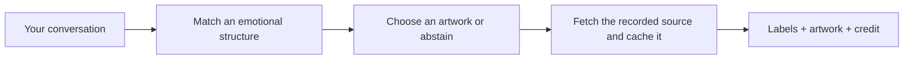

# [GoodVibes] Art Meme

Turn a conversation moment into a fine-art meme: a public-domain painting, short labels, and a museum-style credit strip. An agent skill from **Good Vibes by [TokenSmelter](https://github.com/Token-Smelter)**.



## Install

Requires [uv](https://docs.astral.sh/uv/getting-started/installation/), Python 3.11+, and an agent that supports `SKILL.md` skills. Images need internet access on first use; cached images work offline. uv installs the Python dependencies when each script runs.

```bash
git clone https://github.com/Token-Smelter/goodvibes.art-meme.git
cd goodvibes.art-meme
uv run tools/build_skill.py
```

Copy the generated **`skill/`** directory into your agent's skills directory under the name **`art-meme`**. For Claude Code, use `~/.claude/skills/art-meme/`. If already installed, back it up before replacing it. The repo has a collection prefix; the installed skill name remains `art-meme`.

Alternatively, download the image-free skill ZIP from [Releases](https://github.com/Token-Smelter/goodvibes.art-meme/releases) and extract its `art-meme/` directory there.

Then ask your agent:

> Make a fine-art meme of me dealing with the weekly status report.

The agent chooses from the curated corpus, inspects the image, writes labels, and renders a JPEG. If no painting fits, it should say so rather than force a joke. Invoke it explicitly; it does not post messages or publish images for you.

## Try the renderer directly

From the generated `skill/` directory:

```bash
uv run tools/get_image.py titian-sisyphus
printf '%s\n' '{"artwork":"titian-sisyphus","labels":{"sisyphus":"me","boulder":"the weekly status report"},"out":"/tmp/sisyphus.jpg"}' | uv run tools/render.py
```

The image command returns a local `path` for inspection and source provenance. The renderer also downloads automatically when needed. It keeps the full composition, adds labels without cropping, and appends artist/title/date below the canvas.

## Images stay outside the package

The repository and generated skill distribute **code and annotations, not artwork files**. Downloads resolve the exact recorded Wikimedia Commons filename, never a new artwork search.

| Setting | Behavior |
|---|---|
| Cache | `${XDG_CACHE_HOME:-~/.cache}/art-meme`, or `ART_MEME_CACHE_DIR` |
| Integrity | SHA-256 recorded on download and verified on every cache reuse |
| Refresh | `uv run tools/get_image.py <id> --refresh` bypasses local/cache copies |
| Source changes | First downloads/refreshes use the current Commons file; historical revisions are not pinned |
| Failures | Unavailable sources and corrupt cache entries produce errors, not search substitutions |
| Fonts | System DejaVu on Linux, Georgia/Arial on macOS/Windows, or user-supplied `fonts/serif.ttf` and `fonts/sans-bold.ttf` |

## Extend it

- **`structures.yaml`** defines reusable relations between roles.
- **`corpus/*.yaml`** identifies artworks, label geometry, and each artwork's role bindings through `uses[]`. Mapping is many-to-many.
- **`tools/SKILL.template.md`** supplies the agent instructions.
- **`tools/build_skill.py`** generates the shareable skill. Never hand-edit `skill/`.
- **`tools/fetch_commons.py`** is an authoring search helper, not a runtime dependency. Optional local `corpus/images/` copies are ignored by Git and never packaged.

Inspect the original and a test render when adding or changing an annotation. Existing structural matches and label placement are experimental; a successful build is not proof that a joke lands. See [DESIGN.md](./DESIGN.md) for design context, including aspirational behavior not yet enforced by the scripts.

## Check

```bash
uv run --with pillow --with pyyaml python -m unittest discover -s tests -v
uvx ruff check tools tests --select F --ignore E402
uv run tools/build_skill.py
```

The tests use generated fixtures and an external cache; they do not download artwork. uv may need a network connection to obtain dependencies on its first run.

## License

Code and original project documentation/annotations are available under the [MIT License](./LICENSE). Use, modify, redistribute, and sell them; retain the copyright and license notice. No warranty is provided.

**Artwork is separate:** the source records declare public-domain or CC0 status, but the MIT license does not relicense third-party images or fonts. Images download directly from their recorded sources; preserve source links and the rendered credit. Rights declarations are not automated legal verification.
