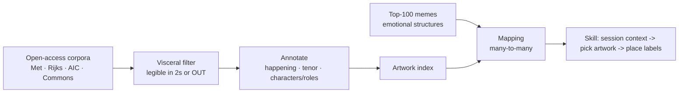

# art-meme

Replace generic meme templates with fine art carrying the same emotional
payload. Goya's *Saturn Devouring His Son* is the seed example: it already IS
a meme — feral consumption, wide-eyed guilt — painted by a master.

## Output form

An **agent skill**, not a static pack. The skill:

1. reads a curated artwork map (built offline, below)
2. uses session context to pick the artwork whose emotional structure fits
3. adds labels/captions positioned on the artwork's character slots

## Pipeline (art-first, not meme-first)

Annotate the art corpus once; memes match against the index forever. The meme
side churns monthly; the art side is fixed and appreciates.



**Visceral filter:** artwork qualifies only if a stranger reads *what is
happening* in two seconds — who wants what, who's winning, who's horrified.
Ambiguity = off the table. This is the meme-slot constraint made operational.

## Annotation schema (draft)

```yaml
artwork: Saturn Devouring His Son
artist: Goya
what_is_happening: a giant frantically eats a human body
emotional_tenor: [horror, compulsion, guilt, cannot-stop]
characters:
  - role: the consumer      # slot A — wide-eyed, mid-act, aware it's wrong
  - role: the consumed      # slot B — passive, already lost
legible_in_2s: yes
meme_slots: [doing-the-thing-you-know-is-bad, devouring, self-destruction]
```

`characters[].role` is load-bearing: it's what the skill matches session
context against, and where labels land.

## Mapping is many-to-many

One meme -> several artworks (skill picks per session tone).
One artwork -> several memes. Example candidates:

| Meme | Structure | Fine art candidates |
|---|---|---|
| Distracted Boyfriend | temptation triangle | Fragonard, Greuze genre scenes |
| This Is Fine | denial amid disaster | Bruegel *Fall of Icarus*; Pompeii frescoes |
| Woman Yelling at Cat | accusation vs. indifference | Caravaggio-school confrontations |
| Feral consumption | appetite over reason | Goya *Saturn* |
| Galaxy Brain | escalating enlightenment | apotheosis / assumption sequences |

## Validation step (before building the skill)

Annotate ~50 artworks, map top 20 memes, run selection manually against a few
real sessions. If the picks land, build the skill; the pack was never the
product, only the test.

## Sources

- Met Open Access: ~490k works, CC0, bulk CSV + images
- Rijksmuseum API: ~700k works, high-res
- Art Institute of Chicago API: CC0
- Wikimedia Commons / Wikidata: motif-tagged paintings
